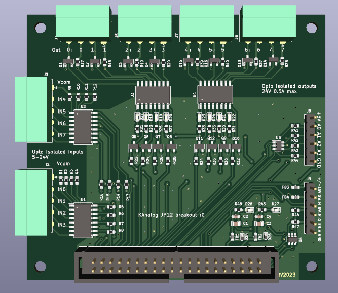

KFlop KAnalog JP12 breakout
==================================

KAnalog board has a connector JP12 with 8 outputs and 8 inputs. Since these IOs are unprotected, 3.3V LVTTL type, they 
are less than suitable for use for general purpose tasks (extra end stops, outputs etc).

This board breaks out these IOs as opto-isolated inputs and outputs, suitable for driving 24V loads and reading 24V inputs.

IO connection follows Kconnect conventions, see optoisolated inputs/outputs section of [this document](http://dynomotion.com/Help/SchematicsKonnect/ConnectorsKonnect.htm).

